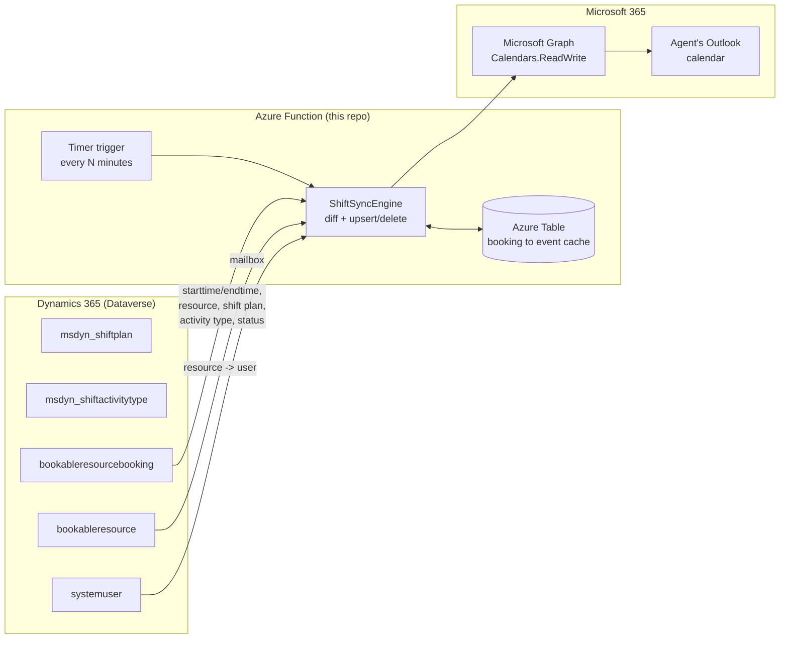

# D365 WFM &rarr; Outlook Calendar Sync

Keeps every agent's Outlook calendar automatically in sync with their published
Dynamics 365 **Workforce Engagement Management (WFM)** shift schedule - no manual export,
no add-in the agent has to install, no third-party service. Runs as a small, secretless
Azure Function that wakes up on a schedule you control, diffs Dataverse against Outlook,
and pushes only what changed.

> **Why this exists:** Dynamics 365 Customer Service / Contact Center's WFM module can
> plan and publish agent shifts, but out of the box those shifts never show up on the
> agent's actual Outlook calendar - the place they (and everyone scheduling meetings with
> them) actually look. This tool closes that gap.

## What it does

Every *N* minutes (you choose *N*):

1. Reads every **published** shift booking from Dataverse for a rolling window (e.g. 1 day
   behind, 30 days ahead - configurable).
2. Resolves each shift to the agent's mailbox.
3. Creates, updates, or deletes the matching Outlook calendar event via Microsoft Graph -
   only touching events that actually changed.
4. Leaves Dataverse and Outlook as the systems of record; the tool's own state is a small,
   disposable cache used only to make runs idempotent and fast.



## Why this is safe to "just install"

- **No hardcoded anything.** Environment URL, tenant, sync window, which booking statuses
  count as "published", which shift activity types to skip, the event subject/category, the
  sync frequency - all configuration, all overridable without touching code. See
  [`docs/configuration.md`](docs/configuration.md).
- **No secrets by default.** The recommended deployment uses the Function App's managed
  identity for both Dataverse and Microsoft Graph - there is no client secret to leak,
  rotate, or forget. See [`docs/security.md`](docs/security.md).
- **Least privilege.** A dedicated, read-only Dataverse security role scoped to exactly six
  tables; a Graph permission scoped (optionally) to only WFM agents' mailboxes via an
  Exchange Online Application Access Policy.
- **Idempotent and self-healing.** Every event is tagged with the originating Dataverse
  booking ID. If the tool's own state cache is ever lost or reset, it finds its own events
  again instead of creating duplicates.
- **Safe by default.** `Sync:DryRun=true` computes and logs exactly what would change with
  zero writes - flip it on before your first real run in a new environment.

## Quickstart

```powershell
# 1. Clone and log in
git clone https://github.com/moliveirapinto/d365-wfm-outlook-sync.git
cd d365-wfm-outlook-sync
azd auth login

# 2. Point it at your Dataverse environment
azd env new my-wfm-sync
azd env set DATAVERSE_ENVIRONMENT_URL https://yourorg.crm.dynamics.com

# 3. Deploy the Azure Function (managed identity, no secrets)
azd up

# 4. Grant the deployed identity access (see docs/setup.md for full detail)
./scripts/setup/4-New-DataverseSecurityRole.ps1 -DataverseEnvironmentUrl https://yourorg.crm.dynamics.com
./scripts/setup/3-New-DataverseApplicationUser.ps1 -DataverseEnvironmentUrl https://yourorg.crm.dynamics.com `
    -ManagedIdentityPrincipalObjectId <FUNCTION_APP_PRINCIPAL_ID> -SecurityRoleId <roleId>
./scripts/setup/2-Grant-GraphCalendarPermission.ps1 -PrincipalObjectId <FUNCTION_APP_PRINCIPAL_ID>

# 5. Try it once, safely
curl -X POST "https://<function-app>.azurewebsites.net/api/sync?code=<function-key>"
```

Full, copy-pasteable walkthrough: [`docs/setup.md`](docs/setup.md).

## Documentation

| Doc | Covers |
|---|---|
| [`docs/architecture.md`](docs/architecture.md) | How the sync loop works, the diff algorithm, idempotency, and design tradeoffs |
| [`docs/data-model.md`](docs/data-model.md) | The Dataverse WFM tables this tool reads and how they relate |
| [`docs/setup.md`](docs/setup.md) | Step-by-step deployment and permission-granting walkthrough |
| [`docs/configuration.md`](docs/configuration.md) | Every setting, its default, and what it controls |
| [`docs/security.md`](docs/security.md) | Auth modes, least privilege, and hardening options |
| [`docs/troubleshooting.md`](docs/troubleshooting.md) | Common problems and how to diagnose them |

## Repository layout

```
src/WfmOutlookSync/     Azure Functions app (.NET 8, isolated worker)
tests/                  Unit tests (xUnit) for the diff/sync engine
infra/                  Bicep infrastructure-as-code (used by azd)
scripts/setup/          One-time permission-granting scripts (Entra + Dataverse + Exchange)
docs/                   Architecture, configuration, security, troubleshooting
```

## Development

```powershell
dotnet build
dotnet test
```

Copy `src/WfmOutlookSync/local.settings.json.sample` to `local.settings.json` and fill in
your own Dataverse/Graph values to run locally with `func start`.

## License

[MIT](LICENSE)

