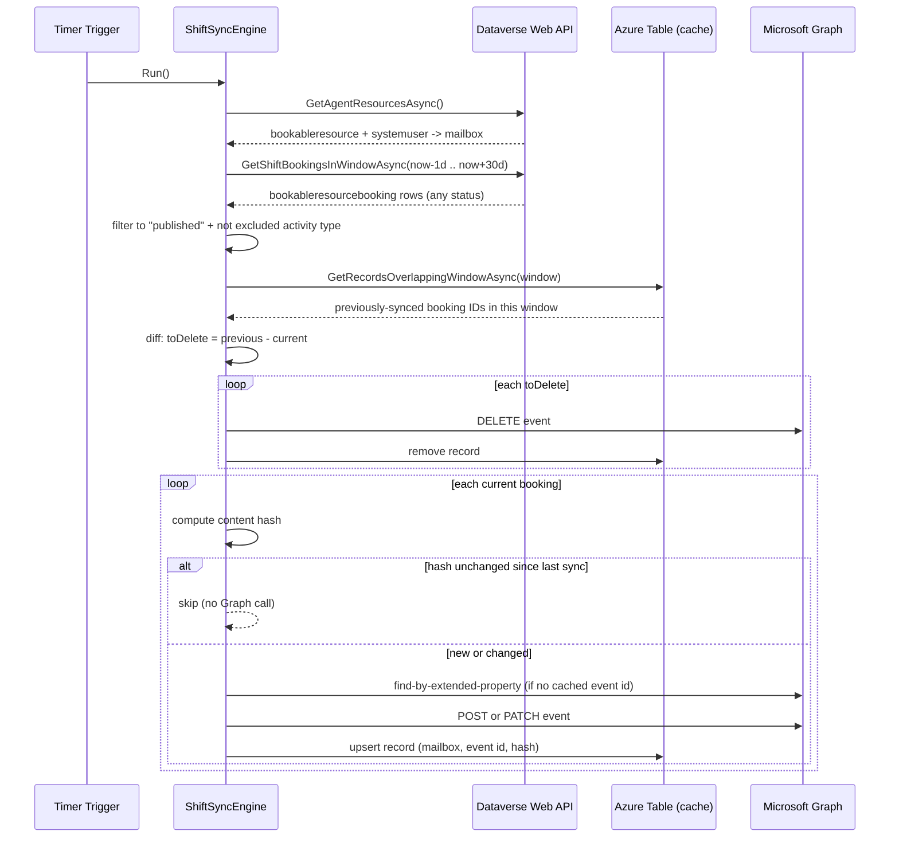

# Architecture

## Goals that shaped the design

1. **Nothing hardcoded.** Every environment-specific or business-policy value is
   configuration, not code.
2. **No secrets by default.** Managed identity end-to-end is the recommended path.
3. **Idempotent.** Running the sync twice in a row (or a thousand times) produces the same
   end state, never duplicate events.
4. **Bounded cost.** Every run does bounded work (one query window, not "every booking that
   ever existed"), so it stays cheap to run every few minutes forever.
5. **Self-healing.** If the tool's own state cache is lost, it recovers by asking Outlook
   directly instead of creating duplicates.

## The sync loop

## Why a windowed diff instead of Dataverse change tracking

Dataverse's Web API change-tracking feature (`Prefer: odata.track-changes`) is the
textbook way to sync deltas including deletes - but it does not support `$filter`, so the
very first (and every subsequent full) pull would have to return *every*
`bookableresourcebooking` row in the environment, including unrelated Field Service work
order bookings, forever. For a shared Dataverse environment that also runs Field Service,
that is an unbounded, unpredictable read.

Instead, every run queries only the configured rolling window
(`Sync:LookBehindDays` .. `Sync:LookAheadDays`) with a server-side `$filter`, bounding the
read to "recent past through near future" regardless of how much history exists. Deletions
are detected by comparing this run's result against what was synced last time for the same
window (kept in the Azure Table state store) - if a previously-synced booking no longer
comes back, it was canceled, unpublished, or hard-deleted upstream, and its Outlook event is
removed.

Trade-off: a booking canceled *and* whose shift window has since scrolled outside
`LookBehindDays` won't be actively cleaned up (rare in practice, and harmless - it's just a
calendar event for a shift that already happened).

## Idempotency and self-healing

Every Outlook event created by this tool carries a **single-value extended property**
containing the originating Dataverse `bookableresourcebookingid`. The Azure Table state
store is the fast path for finding "the event for this booking", but if that cache is ever
reset (e.g. someone deletes the table, or you point the tool at a different storage
account), the engine falls back to asking Graph directly via
`singleValueExtendedProperties/any(...)` before creating a new event - so you can never end
up with two calendar events for the same shift.

A per-booking **content hash** (mailbox + subject + start + end + category + show-as) means
a run that finds nothing changed makes zero Graph calls for that booking - cheap to run
often.

## Components

| Component | Responsibility |
|---|---|
| `Dataverse/DataverseShiftRepository` | Reads `bookableresourcebooking`, `bookableresource`, `systemuser` via the Dataverse Web API (OData) |
| `Graph/OutlookCalendarService` | Creates/updates/deletes Outlook events via Microsoft Graph |
| `State/TableSyncStateStore` | The booking&rarr;event correlation cache (Azure Table Storage) |
| `Sync/ShiftSyncEngine` | Orchestrates the diff and calls the two services above |
| `Functions/TimerSyncFunction` | Runs the engine on a schedule (`SYNC_CRON_SCHEDULE`) |
| `Functions/HttpSyncFunction` | On-demand trigger (`POST /api/sync[?force=true]`), function-key protected |
| `Functions/HttpStatusFunction` | Anonymous health check showing non-secret effective config |

## Why two independent auth configurations (Dataverse vs. Graph)

Some organizations want the Dataverse read path and the Graph write path to use separate
identities/permissions for governance reasons (e.g. different admins own each consent).
`Dataverse:*` and `Graph:*` are configured independently and can each be `ManagedIdentity`
or `ClientSecret` - including a mix, e.g. Dataverse via managed identity and Graph via a
dedicated app registration, if that better fits an organization's approval process.
