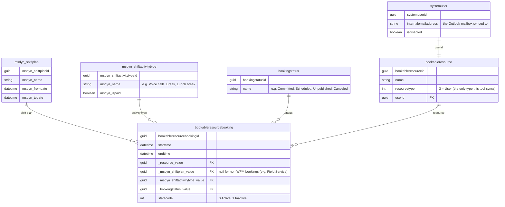

# Dataverse data model (WFM / Contact Center Workforce Engagement Management)

This tool reads six standard Dataverse tables. They ship as part of the Dynamics 365
Customer Service / Contact Center **Workforce Engagement Management (WEM/WFM)** feature -
nothing here is custom, and no table or column name is a configuration value (they're
Microsoft's fixed schema). What *is* configurable is which values of some of these columns
count as "sync this" - see [`configuration.md`](configuration.md).



## Table notes

### `bookableresourcebooking` - the shift instance

One row per activity block inside a shift (a full 8-hour shift is usually several rows: a
"Voice calls" block, a "Break", a "Lunch break", another "Voice calls" block, and so on).
This tool only considers rows where `_msdyn_shiftplan_value` is **not null** - that's what
distinguishes a WFM shift activity from an unrelated Field Service work order booking, which
also lives in this same table.

Key columns read: `starttime`, `endtime`, `_resource_value`, `_msdyn_shiftplan_value`,
`_msdyn_shiftactivitytype_value`, `_bookingstatus_value`, `statecode`. Human-readable names
for the four lookups are read via Dataverse's `@OData.Community.Display.V1.FormattedValue`
annotation rather than a separate `$expand` round trip.

### `bookingstatus` - what "published" means

Out of the box a WFM environment typically has statuses including `Committed`,
`Scheduled`, `Modified`, `Unpublished`, `Proposed`, `Canceled`, `Completed`, `In Progress`,
and others shared with Field Service (`Traveling`, `Hard`, `Soft`). There is no single
universal "IsPublished" flag - which status names count as final/agent-facing varies by
how an organization configured their shift plans. That's why
`Sync:PublishedBookingStatusNames` is a configuration value, not a hardcoded constant
(defaults to `Committed,Scheduled` - check your own environment's `bookingstatus` table and
adjust if needed).

### `msdyn_shiftactivitytype` - what kind of activity

Examples seen in a typical contact-center WFM setup: `Voice calls`, `Chat support`,
`Email support` (all `msdyn_ispaid = true`), `Break`, `Lunch break` (short, sometimes
unpaid). `Sync:ExcludedShiftActivityTypeNames` lets you skip syncing certain types (e.g.
you may not want 15-minute breaks cluttering an agent's calendar).

### `bookableresource` + `systemuser` - resolving the mailbox

`bookableresource.resourcetype` is a global option set; this tool only looks at
`resourcetype = 3` ("User" - as opposed to Contact, Equipment, Facility, Crew, etc.).
Each such resource has a `userid` lookup to `systemuser`, whose
`internalemailaddress` is the mailbox the sync writes to. A resource with no linked user,
or whose user is disabled, is skipped (counted in `EventsSkippedNoMailbox`).

## Discovering this model yourself

If you want to verify any of this against your own environment:

```http
GET [org]/api/data/v9.2/EntityDefinitions?$select=LogicalName,SchemaName
    &$filter=contains(LogicalName,'wem') or contains(LogicalName,'shift')
```

(Metadata queries don't support `contains` server-side in every Dataverse version - if that
filter errors, fetch the full list and filter client-side.) Then inspect attributes with
`GET [org]/api/data/v9.2/EntityDefinitions(LogicalName='bookableresourcebooking')/Attributes`.
